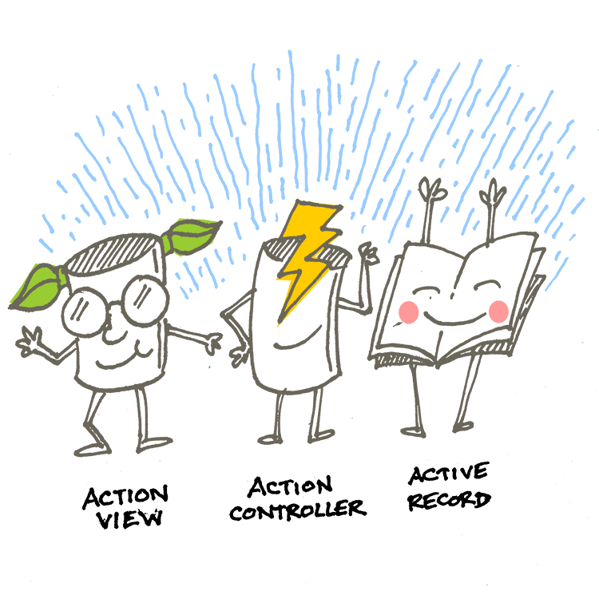

# Ruby on Rails

 <!-- source: http://rubyonrails.org/ -->

<footer>HE-Arc (YBL) 2017</footer>

--------------------------------------------------------------------------------

## Connexion

Nom de domaine et port SSH sur: <http://srvz-webapp2.he-arc.ch/>.

```sh
# Exemple

$ ssh -p 2030 yoan@srvz-webapp2.he-arc.ch
yoan@yoan$ more ~/README.md
```

--------------------------------------------------------------------------------

### Mise à jour de Rails

```sh
yoan@yoan$ rails -v
Rails 5.0.0.1
yoan@yoan$ gem update
Updating installed gems
...
yoan@yoan$ rails -v
Rails 5.0.1
```

--------------------------------------------------------------------------------

### Une application Ruby

Comme pour Laravel, c'est une bonne pratique d'avoir un répertoire pour le contenu publiable sur Internet.

```
$ cd /var/www/app
$ ls
config.ru
Gemfile
Gemfile.lock
public/nginx-puma.png

$ more config.ru
```

--------------------------------------------------------------------------------

## Rack 101

```ruby
run ->(env) do
  [
    200,
    {"Content-Type" => "text/html; charset=utf-8"},
    [
      "<!DOCTYPE html>",
      "<meta charset=utf-8>",
      "<title>Hello!</title>",
      "<h1>Hello</h1>",
      "<p>:-)"
    ]
  ]
end
```

<div class="notes">
Une fonction, Proc ou lambda qui :

- reçoit un tableau associatif de son environement;
- retourne un triplet de réponse HTTP.

Réponse HTTP:

- le code HTTP;
- un tableau associatif des entêtes HTTP;
- un itérateur sur le corps du document.
</div>

--------------------------------------------------------------------------------

### `Gemfile`

Un paquet Ruby se nomme une _gemme_.

```ruby
# Gemfile
source "https://rubygems.org"

gem "puma", "~> 3.6.2"
gem "rack"
```

<div class="notes">
Comme le <code>composer.json</code> pour PHP.
</div>

--------------------------------------------------------------------------------

### NGINX

```nginx
root /var/www/app/public;

location / {
    try_files $uri/index.html $uri @rack;
}

location @rack {
    proxy_pass http://puma;
    proxy_set_header X-Forwarded-For $proxy_add_x_forwarded_for;
    proxy_set_header Host $http_host;
    proxy_redirect off;
}

upstream puma {
    server unix:/tmp/puma.sock fail_timeout=0;
}
```

<div class="notes">
Le serveur HTTP qui sert les fichiers statiques (<code>public</code>) et redirige le reste vers le serveur d'application Ruby (<code>puma</code>).
</div>

--------------------------------------------------------------------------------

### Puma

Le serveur d'application pour Ruby.

```ruby
#!/usr/bin/env puma

environment "production"

directory "/var/www/app"
bind "unix:///tmp/puma.sock"

# À ajouter.
plugin :tmp_restart
```

<div class="notes">
En PHP, nous utilisions PHP-FPM.
Qu'utilisez-vous avec JEE?
</div>

--------------------------------------------------------------------------------

### Serveur

```sh
$ ls /etc/services
cron nginx puma sshd syslog

$ pstree
tini───runsvdir─┬─runsv───cron
                ├─runsv───nginx───4*[nginx]
                ├─runsv───syslog-ng
                └─runsv───bundle─┬─{reactor.rb:151}
                                 ├─{ruby-timer-thr}
                                 ├─{server.rb:301}
                                 └─6*[{thread_pool.rb*}]
```

--------------------------------------------------------------------------------

## Exercice 1

Modifiez l'environnement _puma_ en `development`.

`http://[ PRENOM.NOM | GITHUB ].srvz-webapp2.he-arc.ch/` doit afficher:

```
RACK_ENV
    development
```

--------------------------------------------------------------------------------

## Première application

Archivez `app`.

```sh
$ cd /var/www
$ mv app demoapp
```

Créez une nouvelle application Rails.

```sh
$ rails new app --database=postgresql
$ cd app
```

<div class="notes">
Si vous changez le nom, vous devez modifier les configurations des serveurs.
</div>

--------------------------------------------------------------------------------

### Plein de fichiers

```
app/                # votre code
bin/
config/             # fichiers de config
config.ru           # point d'entrée, « index.php »
db/                 # migrations et seeds
Gemfile             # comme le composer.json
Gemfile.lock
lib/
log/
public/             # fichiers publics
Rakefile
README.md
test/               # tests unitaires, fonctionnels, etc.
tmp/
vendor/
```

--------------------------------------------------------------------------------

## Exercice 2

Que peut-on faire à l'aide de la commande `rails`?

Et de la commande `bundle`?

<div class="notes">
Avant Rails 5, <code>rails</code> et <code>rake</code> avaient des rôles séparés, condensés dans <code>rails</code>.
</div>

--------------------------------------------------------------------------------

### Premier démarrage

```
$ su sv restart puma
```

Kaboom!

--------------------------------------------------------------------------------

### Connexion

Utilisez [pgAdmin][pg3] pour vous connecter à votre base de données.

```sh
$ echo $GROUPNAME $PASSWORD
```

Ou pour les durs à cuire :

```sh
$ psql -h $POSTGRES_HOST -U $GROUPNAME
> \l
> \dn
> \dt
> \q
```

--------------------------------------------------------------------------------

### Configuration

```yaml
default: &default
  adapter: postgresql
  encoding: unicode
  pool: <%= ENV.fetch("RAILS_MAX_THREADS") { 5 } %>
  host: <%= ENV.fetch("POSTGRES_HOST") { "localhost" } %>
  port: <%= ENV.fetch("POSTGRES_PORT") { 5432 } %>
  database: <%= ENV["GROUPNAME"] %>
  username: <%= ENV["GROUPNAME"] %>
  password: <%= ENV["PASSWORD"] %>

development:
  <<: *default

test:
  <<: *default
  schema_search_path: test

production:
  <<: *default
  schema_search_path: production
```

--------------------------------------------------------------------------------

## Application de démo

Téléchargez l'application pré-configurée pour vous.

```sh
$ cd /var/www
$ rm -rf app

$ git clone \
        https://github.com/HE-Arc/rails-intro \
        app

$ cd app
$ bundle install
```

--------------------------------------------------------------------------------

### Migration

Installation de la base de données.

```sh
$ rails db:migrate
```

Que s'est-il passé?

(hint: `git status`)

--------------------------------------------------------------------------------

## Exercice 3

Créez un produit possédant un titre, une description et un prix.

<div class="notes">
Au besoin

    $ git reset --hard
    $ git checkout model-product
</div>

--------------------------------------------------------------------------------

### Réponse

Nous obtenons une migration, un modèle et un test unitaire.

```sh
$ rails generate model \
    product \
        title:string \
        description:text \
        price:decimal
```

RAD!

--------------------------------------------------------------------------------

## Exercice 4

Corrigez le test qui échoue en corrigeant les _fixtures_.

```sh
$ rails db:rollback

$ git reset --hard
$ git clean -fd
$ git checkout product
$ rails db:migrate

$ rails test
```

--------------------------------------------------------------------------------

### Test unitaire

```ruby
# test/models/product_test.rb

class ProductTest < ActiveSupport::TestCase
  test 'T-shirt has a price' do
    product = Product.find_by(title: 'T-shirt')
    assert 0 < product.price
  end
end
```

--------------------------------------------------------------------------------

### Solution

```yaml
# test/fixtures/products.yml

tshirt:
  title: T-shirt
  description: Superbe maillot de corps
  price: 9.99
```

--------------------------------------------------------------------------------

### Validation

Selon Ruby on Rails, la logique métier ne doit pas se trouver dans la base de données.

```ruby
# app/models/product.rb

class Product < ActiveRecord::Base
  validates :title, presence: true
  validates :price, numericality: { greater_than: 0 }
end
```

--------------------------------------------------------------------------------

## Exercice 5

Testez les règles de validations ci-dessus en ajoutant des tests.

```sh
$ git reset --hard
$ git checkout validation
$ rails test
```

--------------------------------------------------------------------------------

### Solution

```ruby
# test/models/product_test.rb

test 'must have a title' do
  assert_not Product.create(price: 10).valid?
end

test 'must have a price greater than zero' do
  assert_raise do
    Product.create!(title: 'Untitled', price: 0)
  end
end
```

--------------------------------------------------------------------------------

### Contrôleur

```sh
$ rails g controller products index

app/assets/javascripts/products.coffee
          /stylesheets/products.scss
   /controllers/products_controller.rb       # def index; end
   /helpers/products_helper.rb
   /views/products/index.html.erb            # index.html.erb

config/routes.rb                             # get 'products/index'

test/controllers/products_controller_test.rb # should get index
```

<div class="notes">
Par convention, un modèle est au singulier et un contrôleur au pluriel.
</div>

--------------------------------------------------------------------------------

### Test unitaire

```ruby
# test/controllers/products_controller_test.rb

test 'should get products on /' do
  get '/'

  assert_response :success
  assert_not_nil assigns(:products)
end
```

--------------------------------------------------------------------------------

## Exercice 6

Corrigez le test du contrôleur.

```sh
$ git reset --hard
$ git clean -fd
$ git checkout controller

$ rails test
```

--------------------------------------------------------------------------------

### Solution

```ruby
# config/routes.rb
root 'products#index'

# app/controllers/products_controller
def index
  @products = Product.all
end

# app/views/products/index.html.rb
<% @products.each do |product| %>
  <h2><%= product.title %></h2>
<% end %>
```

--------------------------------------------------------------------------------

### Taille

Création d'un modèle pour les tailles de nos t-shirts.

```
$ rails generate model size name:string
```

--------------------------------------------------------------------------------

## Exercice 7

Créez un seeder pour les tailles allant de `XS` à `XXL`.

```sh
$ git reset --hard
$ git clean -fd
$ git checkout sizes
$ rails db:migrate

$ rails db:seed

# Test
$ rails console
> pp Size.all
```

--------------------------------------------------------------------------------

### Solution

```ruby
# db/seeds.rb

Size.create([
  {name: 'XS'},
  {name: 'S'},
  {name: 'M'},
  {name: 'L'},
  {name: 'XL'},
  {name: 'XXL'}
])
```

--------------------------------------------------------------------------------

### Relation Produits - Tailles

```sh
$ rails g migration associate_products_and_sizes
```

```ruby
# db/migrate/..._associate_products_and_sizes.rb

create_table :products_sizes do |t|
  t.references :product, :index => true
  t.references :size, :index => true
end
```

--------------------------------------------------------------------------------

### Many-to-many

Dans chaque modèle.

```ruby
# app/models/product.rb
has_and_belongs_to_many :sizes, uniq: true

# app/models/size.rb
has_and_belongs_to_many :products, uniq: true
```

--------------------------------------------------------------------------------

### Test

```sh
$ git reset --hard
$ git clean -fd
$ git checkout habtm
```

Tests depuis la console.

```sh
$ rails console
> xxl = Size.find_by(name: 'XXL')
> xxl.products.size
=> 0
```

<div class="notes">
xxl.products.create(title: 'A', description: 'B', price: 10)
</div>

--------------------------------------------------------------------------------

### Administration

```sh
$ more Gemfile

# Automagic admin interface.
gem 'rails_admin', '~> 1.1'

$ bundle install
$ rails g rails_admin:install
$ touch tmp/restart.txt
```

<div class="notes">

    $ git reset --hard
    $ git checkout admin
    $ bundle install

</div>

--------------------------------------------------------------------------------

### Image

Ajoutez une image à vos produits

```sh
$ more Gemfile

# Toughtbot's paperclip to upload files
gem 'paperclip', '~> 5.1'

$ bundle install
```

--------------------------------------------------------------------------------

### Migration

```sh
$ rails g migration add_image_to_product
```

```ruby
def change
  change_table :products do |t|
    t.attachment :image
  end
end
```

--------------------------------------------------------------------------------

## Exercice 8

Faites qu'on puisse attacher une image depuis l'interface d'administration.

```sh
$ git reset --hard
$ git clean -fd
$ git checkout images
$ rails db:migrate
```

**Indice:** lire la documentation de `paperclip`.

--------------------------------------------------------------------------------

### Solution

```ruby
# app/models/product.rb

has_attached_file: image
validates_attachment_content_type :image, \
    content_type: /\Aimage/
validates_attachment_file_name :image, \
    matches: [/png\z/, /jpe?g\z/]
```

--------------------------------------------------------------------------------

### Ressource

Il aurait été possible de créer modèle, contrôleur et routes de type REST.

```
$ rails generate resource person
$ rails routes
...
```

Testez!

--------------------------------------------------------------------------------

## Détails intéressants de Rails

 <!-- source: http://rubyonrails.org/everything-you-need/ -->

--------------------------------------------------------------------------------

### CSS et JavaScript

- `foundation-rails`
- `bootstrap-sass, ~> 3.3.7`
- `bootstrap, ~> 4.0.0.alpha6`
- `basscss-rails`
- `bulma-rails`
- `mui-sass`
- etc.

Voir [Asset Pipeline](http://guides.rubyonrails.org/asset_pipeline.html)

<div class="notes">
Rails 5.1 proposera de gérer ces éléments-là via <code>webpack</code> ou <code>yarn</code>. D'ici là, il nous faut passer par les <code>gems</code> associées.
</div>

--------------------------------------------------------------------------------

### ActionCable

La nouveauté de Rails 5.0.

Gestion simplifiée des `WebSocket` permettant d'incorporer des fonctionnalités « temps-réel ».

Voir [Action Cable Overview](http://guides.rubyonrails.org/action_cable_overview.html)

--------------------------------------------------------------------------------

### ActiveJob

Gestion des tâches de fond, comme envoyer des e-mails, redimensionner des images, ...

Voir [Active Jobs Basics](http://guides.rubyonrails.org/active_job_basics.html)

--------------------------------------------------------------------------------

### ActionView

La bonne méthode pour créer des formulaires et les lier à des données.

```erb
<%= form_for @article, url: {action: 'create'} do |f| %>
  <%= f.text_field :title %>
  <%= f.submit 'Create' %>
<% end %>
```

Voir [Form Helpers](http://guides.rubyonrails.org/form_helpers.html)

--------------------------------------------------------------------------------

## Problème avec Ruby on Rails

 <!-- source: https://github.com/microservices-demo/microservices-demo/blob/master/docs/internal-docs/design.md -->

--------------------------------------------------------------------------------

## Conclusion

- Laravel tire son inspiration première de Ruby on Rails.
- Rails est plus cohérent dans son ensemble tirant partie des fonctionnalités de Ruby.

--------------------------------------------------------------------------------

 <!-- https://twitter.com/dhh/status/815601578329575424 -->

--------------------------------------------------------------------------------

### Difficultés pour vous

- Construisez un produit au fur et à mesure
- Déployez souvent
- Essayer des bibliothèques
- Et ayez un plan!

--------------------------------------------------------------------------------

 <!-- http://imgarcade.com/1/riding-unicorn-rainbow/ -->

<style>
h3 { margin: 50px 0 2em 1em; }
p { font-size: 100% !important; margin: 1em .5em !important; }
img { max-width: 800px; max-height: 450px; margin: 0 auto; }

#ssh--p-port-prenomsrvzct-52 + table { width: 90%; margin: 1em auto 0; font-size: 70%; border-collapse: collapse }
#ssh--p-port-prenomsrvzct-52 + table thead tr { background: #222; color: #fff }
#ssh--p-port-prenomsrvzct-52 + table tr:nth-child(even) { background: #eee; }

#configuration + .sourceCode > pre { font-size: 60% }
#plein-de-fichiers + pre { font-size: 75% }
#contrôleur + .sourceCode { font-size: 85% }
#serveur + .sourceCode { font-size: 90% }
#nginx + .nginx { font-size: 75% }
</style>

[pg3]: https://www.pgadmin.org/
